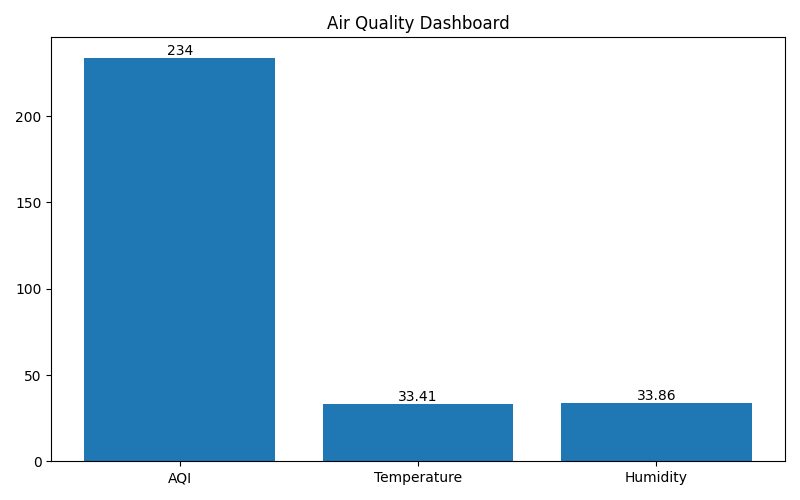
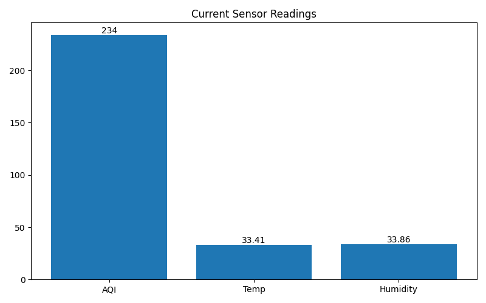
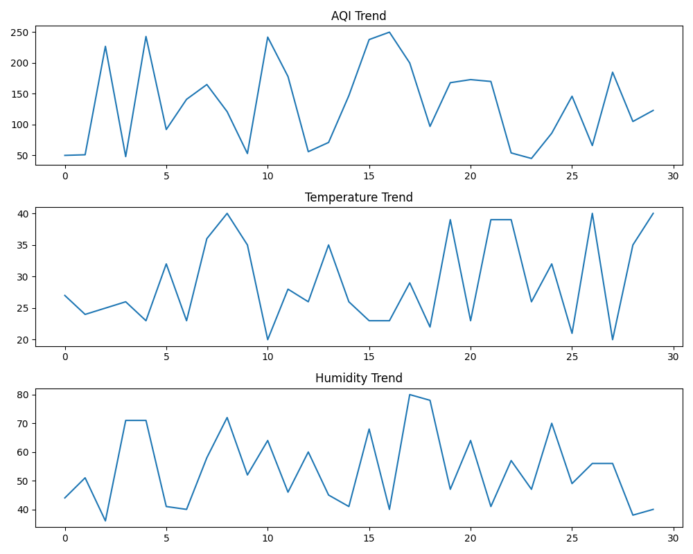
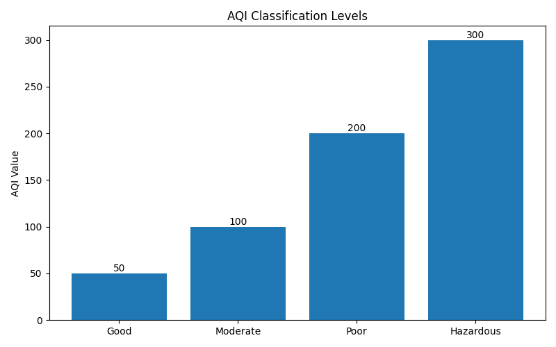

# IoT Air Quality & Pollution Monitoring Dashboard

## Overview

The IoT Air Quality & Pollution Monitoring Dashboard is a smart environmental monitoring system designed to track air quality conditions using simulated IoT sensor data. The project monitors Air Quality Index (AQI), temperature, and humidity, analyzes pollution levels, generates alerts, stores environmental data, and visualizes insights through interactive charts and dashboards.

This project demonstrates the integration of IoT concepts, environmental monitoring, data logging, analytics, and visualization using Python and Arduino.

---

## Features

* Real-time AQI monitoring
* Temperature and humidity tracking
* Pollution level classification
* Automatic alert generation
* Environmental data logging in CSV format
* Dashboard visualization
* AQI trend analysis
* Sensor data visualization
* Pollution category comparison
* Arduino-compatible IoT implementation

---

## Technologies Used

* Python
* Arduino IDE
* Pandas
* Matplotlib
* NumPy

---

## Project Structure

```text
IoT-Air-Quality-Pollution-Monitoring-Dashboard/
│
├── arduino_code/
│   └── air_quality_monitor.ino
│
├── python_simulation/
│   ├── sensor_simulator.py
│   ├── aqi_calculator.py
│   ├── alert_system.py
│   └── dashboard_generator.py
│
├── data/
│   └── air_quality_logs.csv
│
├── images/
│   ├── dashboard.png
│   ├── output_graphs.png
│   ├── sensor_readings.png
│   └── aqi_comparison.png
│
├── README.md
├── requirements.txt
├── .gitignore
└── main.py
```

---

## System Workflow

1. Simulate sensor readings for AQI, temperature, and humidity.
2. Calculate air quality status.
3. Generate alerts based on pollution levels.
4. Store environmental data in CSV format.
5. Analyze historical readings.
6. Generate visual dashboards and charts.
7. Display monitoring results.

---

## Installation

### Create Virtual Environment

```bash
python -m venv venv
```

### Activate Virtual Environment

**Windows**

```bash
venv\Scripts\activate
```

### Install Dependencies

```bash
pip install -r requirements.txt
```

### Run Project

```bash
python main.py
```

---

## Output Files

The system automatically generates:

### Dashboard Summary



### Sensor Readings



### Trend Analysis



### AQI Classification Levels



---

## Sample Data Log

```csv
Timestamp,AQI,Temperature,Humidity,Status
2026-06-11 14:28:58,108,19.38,68.54,Poor
2026-06-11 14:30:15,72,25.40,60.20,Moderate
2026-06-11 14:31:02,45,22.80,55.10,Good
```

---

## AQI Classification

| AQI Range | Status    |
| --------- | --------- |
| 0 - 50    | Good      |
| 51 - 100  | Moderate  |
| 101 - 200 | Poor      |
| 201 - 300 | Hazardous |

---

## Applications

* Smart City Monitoring
* Industrial Pollution Tracking
* Environmental Research
* Air Quality Assessment
* Educational IoT Projects
* Public Health Awareness

---

## Future Enhancements

* Live IoT sensor integration
* Cloud data storage
* ThingSpeak dashboard integration
* Mobile application support
* SMS and Email alerts
* Machine Learning-based pollution prediction
* Real-time AQI forecasting

---

## Learning Outcomes

* IoT System Design
* Sensor Data Processing
* Environmental Monitoring
* Data Logging Techniques
* Dashboard Development
* Data Visualization
* Python Programming
* Arduino Programming

---

## Author

Ananya Jain

---


